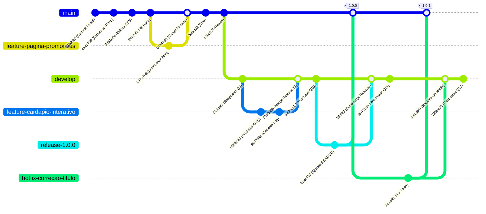

# Relatório de Exercícios - Git, GitHub e GitFlow
**Aluno:** Guilherme
**Matéria:** Engenharia da Qualidade e Confiabilidade
**Professor:** Sergio Souza Novak

---

## Parte 1: Fundamentos do Git

### Questão 1: Inicializando o Repositório

#### a) Comandos e saídas do terminal:
Criei a pasta do projeto e iniciei o git nela:
```powershell
PS C:\Users\Lenovo\Documents\7 PERIODO\ENGENHARIA DE QUALIDADE E CONFIABILIDADE\ATIVIDADE-11.06> mkdir lanchonete-web
PS C:\Users\Lenovo\Documents\7 PERIODO\ENGENHARIA DE QUALIDADE E CONFIABILIDADE\ATIVIDADE-11.06> cd lanchonete-web
PS C:\Users\Lenovo\Documents\7 PERIODO\ENGENHARIA DE QUALIDADE E CONFIABILIDADE\ATIVIDADE-11.06\lanchonete-web> git init
Initialized empty Git repository in C:/Users/Lenovo/Documents/7 PERIODO/ENGENHARIA DE QUALIDADE E CONFIABILIDADE/ATIVIDADE-11.06/lanchonete-web/.git/
```

#### b) Criação dos arquivos:
Criei os arquivos vazios `index.html`, `style.css`, `cardapio.js` e `README.md` dentro da pasta.

#### c) O que significa "Untracked files"?
Rodei o `git status` e apareceu isso:
```powershell
PS C:\Users\Lenovo\Documents\7 PERIODO\ENGENHARIA DE QUALIDADE E CONFIABILIDADE\ATIVIDADE-11.06\lanchonete-web> git status
On branch main

No commits yet

Untracked files:
  (use "git add <file>..." to include in what will be committed)
	README.md
	cardapio.js
	index.html
	style.css

nothing added to commit but untracked files present (use "git add" to track)
```
**Explicação:**
Isso de "Untracked files" (arquivos não rastreados) significa que esses arquivos são novos na pasta e o Git ainda não está vigiando eles. Se eu fizer um commit agora, eles não vão ser salvos. Pra salvar, preciso primeiro adicionar eles na área de preparação (Staging Area) com o comando `git add`.

---

### Questão 2: Primeiro Commit: Preparando e Salvando

#### a) Adicionando o README.md e rodando git status:
```powershell
PS C:\Users\Lenovo\Documents\7 PERIODO\ENGENHARIA DE QUALIDADE E CONFIABILIDADE\ATIVIDADE-11.06\lanchonete-web> git add README.md
PS C:\Users\Lenovo\Documents\7 PERIODO\ENGENHARIA DE QUALIDADE E CONFIABILIDADE\ATIVIDADE-11.06\lanchonete-web> git status
On branch main

No commits yet

Changes to be committed:
  (use "git rm --cached <file>..." to unstage)
	new file:   README.md

Untracked files:
  (use "git add <file>..." to include in what will be committed)
	cardapio.js
	index.html
	style.css
```
**O que mudou:**
O `README.md` foi pro estado "Changes to be committed", ou seja, ele já tá na Staging Area esperando pra ser commitado. Os outros arquivos continuam como "Untracked" porque ainda não adicionei eles.

#### b) Adicionando o resto:
Rodei `git add .` pra colocar todo o resto na Staging Area.

#### c) Commit inicial:
Fiz o commit com a mensagem pedida:
```powershell
PS C:\Users\Lenovo\Documents\7 PERIODO\ENGENHARIA DE QUALIDADE E CONFIABILIDADE\ATIVIDADE-11.06\lanchonete-web> git commit -m "feat: estrutura inicial do projeto"
[main (root-commit) 1d2dd60] feat: estrutura inicial do projeto
 5 files changed, 53 insertions(+)
 create mode 100644 README.md
 create mode 100644 cardapio.js
 create mode 100644 index.html
 create mode 100644 respostas.md
 create mode 100644 style.css
```
**Hash curto:** `1d2dd60`

#### d) Rodando git log --oneline:
```powershell
PS C:\Users\Lenovo\Documents\7 PERIODO\ENGENHARIA DE QUALIDADE E CONFIABILIDADE\ATIVIDADE-11.06\lanchonete-web> git log --oneline
1d2dd60 feat: estrutura inicial do projeto
```
**O que ele mostra:**
Ele mostra o histórico de commits de um jeito bem resumido (uma linha por commit). Cada linha tem o hash curto do commit (que serve pra identificar ele) e a mensagem que eu escrevi quando salvei.

---

### Questão 3: Modificando e Rastreando Arquivos

Criei a estrutura HTML básica no `index.html` e salvei.

#### a) Diferença de Untracked vs Modified:
```powershell
PS C:\Users\Lenovo\Documents\7 PERIODO\ENGENHARIA DE QUALIDADE E CONFIABILIDADE\ATIVIDADE-11.06\lanchonete-web> git status
On branch main
...
Changes not staged for commit:
	modified:   index.html
```
- **Untracked:** É um arquivo totalmente novo que o Git nunca viu ou salvou antes no histórico.
- **Modified:** É um arquivo que já foi salvo em algum commit passado, mas que eu mexi e alterei o código dele agora no computador. O Git percebe que ele mudou em relação à versão antiga.

#### b) Rodando git diff antes de dar add:
```diff
diff --git a/index.html b/index.html
--- a/index.html
+++ b/index.html
@@ -1 +1,65 @@
-<!-- index.html -->
+<!DOCTYPE html>
+<html lang="pt-BR">
+...
```
**O que ele mostra:**
O `git diff` mostra as linhas exatas que eu mudei no código. O que tá com sinal de `-` vermelho foi removido, e o que tá com `+` verde foi adicionado.

#### c) Commit da alteração:
Rodei `git add index.html` e depois `git commit -m "feat: adiciona estrutura basica do HTML"`.

---

### Questão 4: Histórico de Versões com git log

Fiz mais duas alterações: adicionei as regras de design no `style.css` e coloquei o clique no botão no `cardapio.js`, commitando cada um separado.

#### a) Rodando git log completo:
```powershell
commit 24c79fcd0353bf5fa9633484a92446c239381b10
Author: guilhermeDev1050 <guilhermejunco@hotmail.com>
Date:   Thu Jun 11 21:14:53 2026 -0300

    feat: adiciona comportamento base ao cardapio
```
**Campos do commit:**
- **Hash completo:** É aquele código gigante que identifica o commit de forma única no mundo.
- **Author:** Nome e e-mail de quem fez o commit.
- **Date:** Dia, mês, ano e hora exata em que o commit foi feito.
- **Mensagem:** O texto explicativo que eu escrevi pra descrever as mudanças.

#### b) Rodando git log --oneline --graph:
```powershell
* 24c79fc feat: adiciona comportamento base ao cardapio
* 3b51404 style: adiciona estilos basicos do site
* ...
```
**Significado do asterisco `*`:**
O `*` é a representação de um commit na linha do tempo do Git. Se tivermos branches separadas, esses asteriscos ajudam a ver as ramificações e os caminhos que os commits tomaram até se juntarem.

#### c) Por que escrever mensagens claras nos commits?
Porque ajuda muito no trabalho profissional. Se der algum bug, dá pra olhar o histórico e saber exatamente quando e por que o código foi alterado, sem ter que ficar caçando no meio das linhas de código. Também facilita pros outros desenvolvedores entenderem o que eu fiz sem precisar me perguntar toda hora.

---

### Questão 5: Trabalhando com Branches: Nova Funcionalidade

#### a) Criar e ir pra branch nova:
```powershell
PS C:\Users\Lenovo\Documents\7 PERIODO\ENGENHARIA DE QUALIDADE E CONFIABILIDADE\ATIVIDADE-11.06\lanchonete-web> git checkout -b feature/pagina-promocoes
Switched to a new branch 'feature/pagina-promocoes'
```

#### b) Criei e commitei o promocoes.html:
Criei o arquivo `promocoes.html` com a estrutura das ofertas da lanchonete e fiz o commit dele nessa branch.

#### c) Rodando git branch e o significado do asterisco `*`:
```powershell
PS C:\Users\Lenovo\Documents\7 PERIODO\ENGENHARIA DE QUALIDADE E CONFIABILIDADE\ATIVIDADE-11.06\lanchonete-web> git branch
* feature/pagina-promocoes
  main
```
O asterisco verde indica qual é a branch que tá ativa agora na minha máquina. Tudo que eu fizer de alteração vai ser gravado nela.

#### d) Voltando pra main e verificando o arquivo:
Rodei `git checkout main`.
O arquivo `promocoes.html` simplesmente sumiu da pasta do meu computador!
**Por que isso acontece:**
Isso acontece porque eu criei e commitei o arquivo só na branch `feature/pagina-promocoes`. A branch `main` ainda não sabe que esse arquivo existe. Quando eu volto pra `main`, o Git atualiza os arquivos da pasta pra ficarem exatamente iguais ao estado da `main`, escondendo o arquivo da feature.

---

### Questão 6: Integrando Branches com git merge

#### a) Fazendo o merge na main:
```powershell
PS C:\Users\Lenovo\Documents\7 PERIODO\ENGENHARIA DE QUALIDADE E CONFIABILIDADE\ATIVIDADE-11.06\lanchonete-web> git merge feature/pagina-promocoes -m "Merge branch 'feature/pagina-promocoes'"
Merge made by the 'ort' strategy.
 promocoes.html | 232 +++++++++++++++++++++++++++++++++++++++++++++++++++++++++
 1 file changed, 232 insertions(+)
 create mode 100644 promocoes.html
```

#### b) Estratégia de merge que o Git usou:
O Git usou a estratégia **ort** (`Merge made by the 'ort' strategy.`).
*Nota:* Se a minha branch `main` não tivesse novos commits depois que eu criei a branch de feature, o Git faria um merge do tipo **Fast-forward** (só moveria o ponteiro pra frente). Mas como eu fiz commits de respostas na `main` nesse meio tempo, o histórico divergiu e ele fez um merge de 3 vias clássico usando o algoritmo ORT (que é o padrão moderno do Git).

#### c) Rodando git log --oneline --graph após o merge:
```powershell
*   0774765 Merge branch 'feature/pagina-promocoes'
|\  
| * 5372708 feat: adiciona pagina de promocoes
* | 85b3e31 chore: atualiza respostas da questao 5
|/  
* ff3ce4f chore: atualiza respostas da questao 4
```
Dá pra ver no desenho que o histórico se dividiu depois do commit `ff3ce4f`: de um lado os commits da main e do outro o commit da feature. Desse modo, as linhas se juntaram de novo no commit de merge `0774765`.

#### d) Deletando a branch feature e a importância disso:
Rodei `git branch -d feature/pagina-promocoes` pra apagar a branch local.
É bom deletar branches que já foram integradas pra não ficar com aquela lista infinita de branches velhas acumulando poeira no repositório. Mantém a casa limpa e evita que alguém tente mexer em branch que já foi fechada.

---

### Questão 7: Desfazendo Erros com git revert

#### a) Commit errado no style.css:
Fui no `style.css`, adicionei `background: pink !important;` no final e commitei:
`git commit -am "style: adiciona cor de fundo incorreta"`

#### b) Identificar o hash com git log --oneline:
```powershell
3efad02 style: adiciona cor de fundo incorreta
```
O hash do commit ruim é `3efad02`.

#### c) Rodando git revert e explicações:
```powershell
PS C:\Users\Lenovo\Documents\7 PERIODO\ENGENHARIA DE QUALIDADE E CONFIABILIDADE\ATIVIDADE-11.06\lanchonete-web> git revert 3efad02 --no-edit
[main c49d27f] Revert "style: adiciona cor de fundo incorreta"
```
**Diferença de `git revert` e `git reset`:**
- O `git revert` cria um commit novo que faz exatamente o contrário do commit ruim, desfazendo a alteração sem alterar o passado.
- O `git reset` apaga os commits ruins voltando o histórico no tempo (como se eles nunca tivessem existido).

**Por que o `revert` é mais seguro em equipe?**
Porque ele não mexe no histórico passado. Se eu usar `git reset`, vou apagar commits e depois vou ter que dar um push forçado (`git push --force`), o que quebra o repositório de todo mundo que já baixou os commits antigos. O `revert` só adiciona um commit de correção, então todo mundo recebe ele numa boa na hora de dar `git pull`.

---

### Questão 8: Repositório Remoto com GitHub

#### b) Conectando o remoto e subindo:
Como eu já tinha clonado o repositório direto do link do GitHub, a conexão com a `origin` já tava configurada. Só precisei rodar o push:
```powershell
PS C:\Users\Lenovo\Documents\7 PERIODO\ENGENHARIA DE QUALIDADE E CONFIABILIDADE\ATIVIDADE-11.06\lanchonete-web> git push -u origin main
```

#### c) O que significa a flag `-u` no git push?
Significa `--set-upstream`. Ela faz com que a minha branch local `main` fique "linkada" com a branch `origin/main` lá no GitHub. Assim, nas próximas vezes que eu for atualizar o código, só preciso digitar `git push` ou `git pull` e o Git já sabe exatamente pra onde mandar e de onde baixar.

#### d) Alteração no GitHub e executando git pull:
Fiz uma edição no `README.md` direto no site do GitHub e depois rodei o `git pull` na minha máquina:
```powershell
PS C:\Users\Lenovo\Documents\7 PERIODO\ENGENHARIA DE QUALIDADE E CONFIABILIDADE\ATIVIDADE-11.06\lanchonete-web> git pull
From https://github.com/guilhermeDev1050/atividade-git-github
   295455d..f760fa3  main       -> origin/main
Updating 295455d..f760fa3
Fast-forward
 README.md | 2 ++
 1 file changed, 2 insertions(+)
```
**O que o git pull fez:**
Ele foi lá no GitHub, viu que tinha um commit novo que eu fiz no site, baixou esse commit (que é o `git fetch`) e mesclou ele no meu projeto local (que é o `git merge`). Ele usou a estratégia Fast-forward e atualizou o meu `README.md` local com o texto novo de forma limpa.

---

## Parte 2: GitFlow — Fluxo Profissional de Desenvolvimento

### Questão 9: Inicializando o GitFlow

#### b) Rodar o git flow init e saída do terminal:
Rodei o comando usando o `-d` pra aceitar todos os nomes padrão de branch:
```powershell
PS C:\Users\Lenovo\Documents\7 PERIODO\ENGENHARIA DE QUALIDADE E CONFIABILIDADE\ATIVIDADE-11.06\lanchonete-web> git flow init -d
Using default branch names.
...
```

#### c) Rodando git branch e para que serve a develop:
```powershell
PS C:\Users\Lenovo\Documents\7 PERIODO\ENGENHARIA DE QUALIDADE E CONFIABILIDADE\ATIVIDADE-11.06\lanchonete-web> git branch
* develop
  main
```
A branch nova criada é a **`develop`**.
Ela serve como a branch de integração. É nela que a gente junta todo o trabalho do dia a dia (as novas features que vamos desenvolvendo). O código nela fica pronto pra ser testado pras próximas versões. A `main` a gente deixa quietinha só com código estável que tá rodando em produção.

#### d) Push da branch develop:
```powershell
PS C:\Users\Lenovo\Documents\7 PERIODO\ENGENHARIA DE QUALIDADE E CONFIABILIDADE\ATIVIDADE-11.06\lanchonete-web> git push -u origin develop
```

---

### Questão 10: Ciclo de Feature: Novo Cardápio Online

#### a) Iniciando a feature e branch atual:
```powershell
PS C:\Users\Lenovo\Documents\7 PERIODO\ENGENHARIA DE QUALIDADE E CONFIABILIDADE\ATIVIDADE-11.06\lanchonete-web> git flow feature start cardapio-interativo
Switched to a new branch 'feature/cardapio-interativo'
```
Agora eu tô na branch **`feature/cardapio-interativo`**.

#### b) Editando cardapio.js e commits:
Fui no `cardapio.js` e adicionei o array de objetos com os itens do cardápio e fiz dois commits separados pra salvar o progresso:
1. `feat: adiciona array de produtos do cardapio`
2. `feat: implementa exibicao do cardapio no console`

#### c) Finalizando a feature:
```powershell
PS C:\Users\Lenovo\Documents\7 PERIODO\ENGENHARIA DE QUALIDADE E CONFIABILIDADE\ATIVIDADE-11.06\lanchonete-web> git flow feature finish cardapio-interativo
Switched to branch 'develop'
Merge made by the 'ort' strategy.
 Deleted branch feature/cardapio-interativo (was 987749c).
```
**O que o comando fez automaticamente:**
1. Fez o merge da branch `feature/cardapio-interativo` na branch `develop`.
2. Deletou a branch da feature localmente.
3. Me colocou de volta na branch `develop`.
O código foi enviado para a branch **`develop`**.

#### d) Rodando git log --oneline --graph:
```powershell
*   03b088b Merge branch 'feature/cardapio-interativo' into develop
|\  
| * 987749c feat: implementa exibicao do cardapio no console
| * 59d834d feat: adiciona array de produtos do cardapio
|/  
* 068daf1 chore: atualiza respostas da questao 9
```
**Explicação do fluxo:**
O fluxo nasceu na branch `develop` (commit `068daf1`), abriu a branch de feature onde fiz os commits `59d834d` e `987749c` e, na finalização, o GitFlow juntou tudo de volta na `develop` através do commit de merge `03b088b`, deletando a branch temporária em seguida.

---

### Questão 11: Ciclo de Release: Preparando a Versão 1.0

#### a) Inicializando a release:
```powershell
PS C:\Users\Lenovo\Documents\7 PERIODO\ENGENHARIA DE QUALIDADE E CONFIABILIDADE\ATIVIDADE-11.06\lanchonete-web> git flow release start 1.0.0
Switched to a new branch 'release/1.0.0'
```
A branch é a **`release/1.0.0`** e ela nasce a partir da branch **`develop`**.

#### b) Ajustes finos e commit:
Atualizei o `README.md` com as instruções de uso e mexi no rodapé do `index.html`. Depois commitei:
`git commit -am "chore: prepara release v1.0.0"`

#### c) Finalizando a release:
```powershell
PS C:\Users\Lenovo\Documents\7 PERIODO\ENGENHARIA DE QUALIDADE E CONFIABILIDADE\ATIVIDADE-11.06\lanchonete-web> git flow release finish -m "Release 1.0.0" 1.0.0
```
**O que aconteceu com a main e develop:**
- A **`main`** recebeu o merge da branch de release, trazendo todo o código novo e gerando a tag `1.0.0`.
- A **`develop`** recebeu o back-merge da branch de release, garantindo que os ajustes finais feitos na release também fossem salvos nela para futuros desenvolvimentos.
- A branch `release/1.0.0` foi excluída.

#### d) Rodando git tag e a função da tag no GitFlow:
```powershell
PS C:\Users\Lenovo\Documents\7 PERIODO\ENGENHARIA DE QUALIDADE E CONFIABILIDADE\ATIVIDADE-11.06\lanchonete-web> git tag
1.0.0
```
A tag serve como um "carimbo" ou uma marcação estática para um ponto específico do histórico (um commit). No GitFlow, ela é usada pra marcar as versões oficiais que foram lançadas pra produção (como `1.0.0`, `1.1.0`), facilitando muito achar ou restaurar versões antigas do sistema se der alguma treta no futuro.

---

### Questão 12: Ciclo de Hotfix: Corrigindo Bug em Produção

#### a) Iniciando o hotfix e por que ele nasce da main:
```powershell
PS C:\Users\Lenovo\Documents\7 PERIODO\ENGENHARIA DE QUALIDADE E CONFIABILIDADE\ATIVIDADE-11.06\lanchonete-web> git flow hotfix start correcao-titulo
Switched to a new branch 'hotfix/correcao-titulo'
```
**Por que o hotfix nasce da `main`?**
Porque a `main` é a branch que tá rodando em produção (o site no ar). Como o bug tá acontecendo no site ao vivo, precisamos consertar ele rápido a partir do código estável que tá lá. A `develop` pode ter códigos de novas funcionalidades que ainda estão incompletos e não podem ir pro ar. Criando o hotfix a partir da `main`, a gente corrige só o bug e sobe a correção sem risco de subir coisas inacabadas.

#### b) Correção do bug e commit:
Corrigi o erro de digitação do título do site no `index.html` e commitei:
`git commit -am "fix: corrige titulo da pagina principal"`

#### c) Finalização do hotfix e branches mescladas:
```powershell
PS C:\Users\Lenovo\Documents\7 PERIODO\ENGENHARIA DE QUALIDADE E CONFIABILIDADE\ATIVIDADE-11.06\lanchonete-web> git flow hotfix finish correcao-titulo
```
**Branches mescladas:**
O hotfix foi mesclado na **`main`** (pra atualizar a versão de produção) e na **`develop`** (pra garantir que a correção também fique no código de desenvolvimento e não volte a dar bug na próxima release).

#### d) Número da versão correto após esse hotfix segundo o SemVer:
A nova versão é a **`1.0.1`**.
**Justificativa:**
No SemVer (Versionamento Semântico), as versões usam o formato `MAJOR.MINOR.PATCH`. Como o hotfix foi apenas uma correção de bug simples (bugfix) e não adicionou funcionalidade nova (que seria minor) nem quebrou compatibilidade (que seria major), a gente só incrementa o último número (PATCH), pulando de `1.0.0` para `1.0.1`.

---

### Questão 13: Reflexão Final: GitFlow na Prática

#### a) Diagrama do histórico (Mermaid Gitgraph):



#### b) Opinião sobre o GitFlow:
Eu acho o GitFlow muito bom para projetos grandes, onde tem muitos desenvolvedores trabalhando ao mesmo tempo e onde precisamos manter um controle super rígido das versões que vão pro ar (tipo sistemas de banco, e-commerce grande, apps móveis). 

Mas para projetos pequenos ou startups que precisam atualizar o site toda hora (Continuous Deployment), ele é muito burocrático e enrolado. Ter que rodar 3 ou 4 comandos toda vez que vai subir uma coisinha simples gasta muito tempo e cansa.

#### c) Vantagem e desvantagem percebidas (Com GitFlow vs Sem GitFlow):
- **Vantagem do GitFlow:** O processo de release e de hotfix é muito bem amarrado. Fica super claro o que tá sendo testado pra subir e o que tá rodando estável, reduzindo a chance de subir código quebrado pra produção.
- **Desvantagem do GitFlow:** O histórico de branches fica bem complexo de entender visualmente (um monte de linhas se cruzando) e exige muitos comandos manuais pra abrir, fechar e fazer os merges corretos em cada branch. Aumenta a complexidade operacional da equipe.
